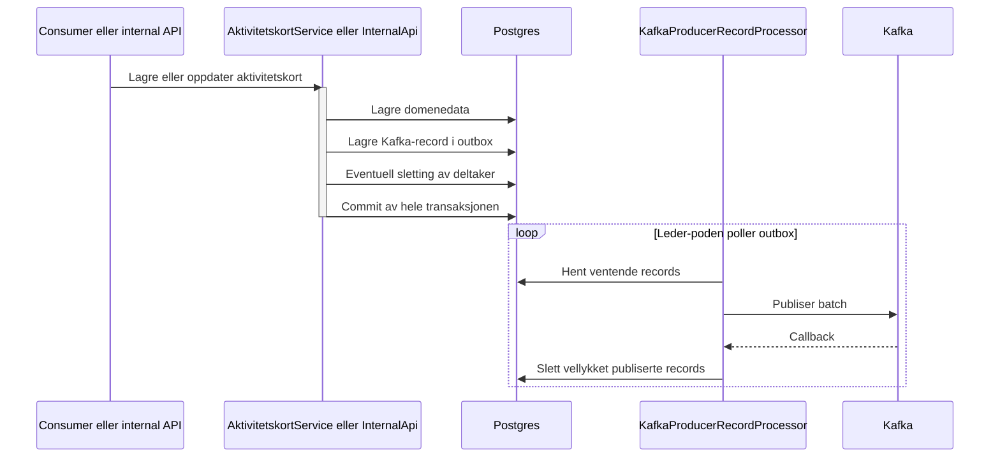

# Transactional outbox for Kafka-publisering

## Sammendrag

Denne PR-en erstatter direkte Kafka-publisering i `amt-aktivitetskort-publisher` med transactional outbox.

Kafka-meldinger lagres nå i Postgres i samme transaksjon som tilhørende domenedata. En egen prosessor publiserer deretter ventende meldinger til Kafka og sletter dem fra outbox-tabellen etter vellykket publisering.

Endringen skal hindre at databasen og Kafka kommer ut av synk ved feil, omstart eller midlertidig utilgjengelig Kafka. Kafka-kontrakten er uendret: topic, key og payload er de samme som før.

## Bakgrunn og problem

Tidligere publiserte `AktivitetskortProducer` direkte til Kafka. Databaseskriving og Kafka-publisering kunne derfor ikke inngå i én atomisk transaksjon.

Det ga to uønskede feilscenarier:

1. Kafka-publiseringen lykkes, men databasetransaksjonen rulles tilbake.
2. Databasen oppdateres, men Kafka-publiseringen feiler eller applikasjonen stopper før meldingen er sendt.

## Tombstone-flyten (kun dev)

Tombstone på `amt.deltaker-v2` publiseres bare fra `POST /internal/slett-deltakere` i `amt-deltaker`, og det endepunktet kaster exception utenfor dev (`if (!Environment.isDev())`). I prod slettes deltakere ved å sette status til `FEILREGISTRERT`, som går gjennom den vanlige oppdateringsflyten. Endringene i tombstone-flyten påvirker derfor ikke prod.

Tombstone-flyten gjør ikke lenger oppslag mot `amt-deltaker`, Arena ACL eller oppfølgingstjenesten. Kodeendringen er liten, og den retter en feil: den gamle flyten satte aldri aktivitetskortet til `AVBRUTT`.

Den gamle flyten laget en `AVBRUTT`-kopi av deltakeren, men sendte bare `deltaker.id` videre til `opprettMelding`, som bygde kortet på nytt fra `amt-deltaker`. Endepunktet i `amt-deltaker` sletter deltakeren rett etter at tombstonen er publisert. Det ga to mulige utfall:

- **Deltakeren var allerede slettet:** Oppslaget ga 404 og flyten kastet en exception. Kortet ble ikke avbrutt, og den lokale deltakeren ble ikke slettet.
- **Deltakeren fantes fortsatt:** Kortet fikk statusen fra `amt-deltaker`, ikke `AVBRUTT`.

`AVBRUTT` er statusen den gamle koden hadde som intensjon. Den stemmer også med prod-slettingen, der `FEILREGISTRERT` gir `AktivitetStatus.AVBRUTT` (`StatusMapping`). Etiketten blir likevel «Avbrutt», ikke «Feilregistrert».

Den nye flyten bruker i stedet den lokale deltakeren og det sist lagrede aktivitetskortet som autoritativt grunnlag for avslutningen. Det innebærer følgende avveining:

- Flyten tåler at deltakeren allerede er slettet hos `amt-deltaker`.
- Avslutningen er ikke avhengig av tilgjengeligheten til tre eksterne tjenester.
- Vi unngår å generere eller hente en ny aktivitetskort-ID under sletting.
- Felter som ikke er relevante for avslutningen beholdes fra siste publiserte aktivitetskort og blir ikke oppfrisket fra eksterne tjenester.
- Status, etikett, statusdetalj, oppgave og endringstidspunkt oppdateres eksplisitt for tombstonen.

Dette er tilsiktet: Formålet med tombstone-flyten er å avbryte det eksisterende aktivitetskortet og rydde lokal deltakerdata, ikke å rekonstruere deltakeren fra en oppstrømsressurs som kan være slettet.

## Valgt løsning

### Skriving til outbox

`AktivitetskortProducer` bygger og serialiserer samme Kafka-record som før, men lagrer recorden i `kafka_producer_record` via `KafkaProducerRecordStorage` fra `no.nav.common:kafka`.

Producer-klassen har fortsatt ansvar for:

- valg av topic
- Kafka-key
- opprettelse av `messageId`
- serialisering av payload

Den har ikke lenger ansvar for selve nettverkskallet til Kafka.

`AktivitetskortProducer` er annotert med `@Transactional(propagation = Propagation.MANDATORY)`. Den kan derfor bare kalles i en aktiv transaksjon, og kaster `IllegalTransactionStateException` ellers. Dette hindrer at en fremtidig kaller legger en melding i outbox uten at den lagres atomisk sammen med domenedataene.

### Atomiske transaksjonsgrenser

`AktivitetskortService` og `InternalApi` bruker `TransactionTemplate` rundt operasjonene som må lykkes eller rulles tilbake sammen.

For en vanlig oppdatering omfatter transaksjonen:

1. lagring av oppfølgingsperioden
2. lagring av aktivitetskortmeldingen
3. lagring av Kafka-recorden i outbox

For tombstone på en aktiv deltaker omfatter transaksjonen:

1. lagring av det avbrutte aktivitetskortet
2. lagring av Kafka-recorden i outbox
3. sletting av den lokale deltakeren

Alle kall til `AktivitetskortProducer` fra disse kallestedene skjer innenfor en eksplisitt transaksjon. `TransactionTemplate` gjør det tydelig hvilke databaseoperasjoner som er atomiske med outbox-recorden.

### Tombstone bygges fra lokale data

Når vi mottar tombstone for en deltaker med et aktivt aktivitetskort, brukes:

- lokalt lagret `DeltakerDbo`
- siste lagrede aktivitetskort

Flyten gjør ikke lenger oppslag mot `amt-deltaker`, Arena ACL eller oppfølgingstjenesten. Begrunnelsen og konsekvensene er beskrevet i avsnittet om tombstone-flyten (kun dev) over.

Det nye aktivitetskortet:

- får aktivitetsstatus `AVBRUTT`
- får oppdatert endringstidspunkt
- får fjernet eventuell oppgave
- får statusdetaljen «Avbrutt»
- får etiketten `AVBRUTT`
- beholder eksisterende informasjon som ikke påvirkes av tombstonen, blant annet `startDato`, `sluttDato` og `avtaltMedNav`

Deretter lagres kortet, outbox-recorden opprettes og den lokale deltakeren slettes i samme transaksjon.

### Drenering av outbox

`KafkaProducerRecordProcessor` fra `no.nav.common:kafka` henter ventende records, publiserer dem til Kafka og sletter vellykket publiserte records.

`BatchedKafkaProducerRecordPublisher` brukes for batchvis publisering. En record slettes først når Kafka-callbacken ikke inneholder en feil.

Prosessoren startes og stoppes av `KafkaOutboxLifecycle`, som implementerer Spring `SmartLifecycle`. Bibliotekets egen shutdown-hook er deaktivert fordi Spring styrer livssyklusen.

### Leader election

Applikasjonen kan kjøre flere pods. `ShedLockLeaderElectionClient` og `JdbcTemplateLockProvider` sørger for at bare én pod drenerer outbox-tabellen om gangen.

ShedLock er valgt fremfor Kubernetes-basert leader election fordi:

- outbox og lås allerede bruker samme Postgres-instans
- løsningen krever ingen ekstra Kubernetes-RBAC eller Lease-ressurs
- `KafkaProducerRecordProcessor` støtter `LeaderElectionClient` direkte
- låsen har tidsbegrensning og kan overtas hvis leder-poden forsvinner

Alle pods kan fortsatt skrive til outbox. Leader election gjelder bare prosessoren som publiserer til Kafka.

## Flyt



## Databasemigrasjon

Flyway-migrasjon `V27__shedlock_and_kafka_producer_record.sql` oppretter:

- sekvensen `kafka_producer_record_id_seq`
- tabellen `kafka_producer_record`
- tabellen `shedlock`

`PostgresJdbcTemplateProducerRepository` henter selv neste verdi fra `kafka_producer_record_id_seq` og sender `id` eksplisitt i `INSERT`. `id`-kolonnen trenger derfor ikke `DEFAULT nextval(...)`.

Migrasjonen sletter eller endrer ingen eksisterende data.

## Kafka-kontrakt og leveringssemantikk

Følgende er uendret:

- topic
- Kafka-key
- payload-format
- `messageId`

Outbox gir varig kø og eventual delivery så lenge applikasjonen og Kafka kommer tilbake i normal drift. Semantikken er fortsatt at-least-once.

Hvis prosessen stopper etter at Kafka har bekreftet publisering, men før outbox-raden er slettet, kan recorden bli publisert på nytt. Konsumenten må derfor fortsatt tåle duplikater. Kafka-key og meldingsinnholdet gjør dette håndterbart på samme måte som tidligere omlevering.

## Internal API

Endepunktene for publisering, resend og sletting skriver nå til outbox i stedet for å sende direkte til Kafka.

Resend og kassering kaller produceren direkte innenfor `TransactionTemplate`. Hver melding får sin egen transaksjon, slik at oppførselen ved feil midt i en liste er som før: meldinger som allerede er lagt i outbox, blir liggende.

Dette gjør oppførselen lik mellom:

- ordinær behandling av Kafka-hendelser
- manuell regenerering av aktivitetskort
- resend
- kassering av aktivitetskort

## Metrikker og observerbarhet

Kafka-produsenten opprettes med `KafkaProducerClientBuilder.withMetrics(...)`.

Biblioteket registrerer blant annet:

- `kafka_producer_status{topic="...", status="ok"}`
- `kafka_producer_status{topic="...", status="failed"}`
- `kafka_producer_current_offset`

Disse metrikkene oppdateres etter Kafka-callbacken og måler faktisk publisering, ikke bare lagring i outbox.

I tillegg er følgende gauge lagt til:

```text
amt_aktivitetskortpublisher_kafka_outbox_ventende
```

Gauge-en teller rader i `kafka_producer_record` ved hver Prometheus-scrape. Den gjør det mulig å oppdage at leader election, prosessoren eller Kafka-publiseringen har stoppet.

Alert på vedvarende eller økende kødybde er ikke del av denne PR-en. Det er dokumentert i `docs/TODO.md` og skal settes opp etter samme mønster som i `amt-person-service`. Enkeltstående records mellom polling-runder skal ikke utløse varsel.

## Nye avhengigheter

- `no.nav.common:kafka`
- ShedLock Spring
- ShedLock JDBC template

Eksisterende implementasjoner fra `no.nav.common:kafka` gjenbrukes:

- `KafkaProducerRecordStorage`
- `PostgresJdbcTemplateProducerRepository`
- `KafkaProducerRecordProcessorBuilder`
- `BatchedKafkaProducerRecordPublisher`
- `KafkaProducerClientBuilder`
- `ProducerUtils`

## Testing

### Transaksjon og rollback

Testene verifiserer at:

- domenedata og outbox-record rulles tilbake sammen
- aktivitetskort, outbox-record og deltakersletting rulles tilbake sammen i tombstone-flyten
- en vellykket transaksjon lagrer riktig topic, key og payload
- `AktivitetskortProducer` kaster `IllegalTransactionStateException` og lagrer ingen outbox-record når den kalles uten transaksjon

### Prosessering

En prosessortest bruker:

- ekte Postgres-repository
- fake `KafkaProducerClient`
- leader election som alltid returnerer leder
- den reelle `KafkaOutboxLifecycle`

Testen verifiserer at en lagret record publiseres, får riktig topic og key, og slettes fra outbox etter vellykket callback.

### Tombstone

Tombstone-testen verifiserer at:

- aktivitetskortet blir `AVBRUTT`
- oppgaven fjernes
- statusdetaljen og etiketten oppdateres
- `startDato`, `sluttDato` og `avtaltMedNav` beholdes fra siste aktivitetskort
- deltakeren slettes lokalt
- flyten ikke trenger stubber for `amt-deltaker`, Arena ACL eller oppfølgingstjenesten

### CI-status

`Run Tests` og `CodeQL Kotlin` var grønne på commit `44c875b29`. Senere commits endrer kode (fjerning av død kode, bevaring av felter i tombstone-flyten og transaksjonskrav på produceren) og må få egne grønne CI-kjøringer før merge.

## Risiko og avgrensninger

### Flyway-historikk

Tidlige commits på branchen hadde separate migrasjoner med navnene `V27` og `V28`. De ble slått sammen før deploy. Offentlig GitHub deployment-historikk viser ingen deployment fra branchen, men `flyway_schema_history` bør likevel kontrolleres dersom en commit har blitt deployet utenom registrert workflow.

Hvis en eldre variant allerede er kjørt, må Flyway-historikken håndteres før denne versjonen startes. Ellers vil checksum eller manglende `V28` kunne stoppe oppstart.

### Ventende records ved rollback

Gammel kode drenerer ikke `kafka_producer_record`. Før rollback må vi derfor kontrollere at outbox-tabellen er tom, eller håndtere ventende records eksplisitt.

### HTTP-kall inne i databasetransaksjoner

Denne PR-en innfører ingen nye HTTP-kall i transaksjoner, men problemet finnes fra før og berøres av endringen.

**Hvor:** `handleDeltaker`, `handleGjennomforing` og `handleArrangor` i `KafkaConsumerService` kjører i `TransactionTemplate`. Inne i transaksjonen bygges kortene via `AktivitetskortService`, som kaller:

- oppfølgingstjenesten (alle flyter)
- Arena ACL og aktivitet-arena-acl (Arena-deltakere)
- `amt-deltaker` for **hver** deltaker ved endring på gjennomføring eller arrangør

**Konsekvens:**

- En treg avhengighet holder databasetilkoblingen og radlåsene. Med liten Hikari-pool kan det gi tomme tilkoblinger for resten av applikasjonen.
- I `handleGjennomforing` og `handleArrangor` kan én transaksjon dekke mange deltakere. Én feil ruller tilbake hele gruppen, og meldingen leveres på nytt.

**Hva outboxen endrer:** Før denne PR-en ble Kafka-meldingen sendt synkront (`send(...).get()`) inne i transaksjonen, så også Kafka-rundturen holdt transaksjonen åpen. Nå er Kafka-skrivingen en lokal `INSERT` i samme transaksjon, og sendingen skjer i prosessoren utenfor transaksjonen. Outboxen gjør altså transaksjonene kortere, men HTTP-kallene er der fortsatt. Tombstone-flyten gjør ikke lenger eksterne kall.

**Hvorfor det ikke er fikset her:** Transaksjonen kan ikke bare fjernes. Hvis `upsert` committes før kortene er oppdatert og noe feiler, gir omlevering `NoChange`, og kortene oppdateres aldri. Løsningen krever at kortene bygges før transaksjonen (HTTP først, så en kort transaksjon rundt database og outbox), slik `amt-person-service` gjør. Det er en større omskriving av `AktivitetskortService` og hører hjemme i en egen PR. Oppgaven er beskrevet i `docs/TODO.md`.

### Ikke del av PR-en

- ingen endring i Kafka-kontrakten
- ingen ny Kafka-topic
- ingen endring i autentisering eller autorisering
- ingen ny Nais-ressurs
- ingen alert-konfigurasjon

## Rollback

1. Stopp ny trafikk eller bekreft at ingen nye records legges i outbox.
2. Kontroller at `kafka_producer_record` er tom.
3. Hvis tabellen ikke er tom, la ny versjon drenere køen eller håndter records eksplisitt.
4. Rull tilbake applikasjonskoden.
5. Behold tabellene og sekvensen fra `V27`.

Tabellene bør ikke droppes som del av en kode-rollback. De er additive, og sletting kan føre til tap av ventende meldinger.

## Verifisering etter deploy til dev

- [ ] Flyway `V27` kjører uten valideringsfeil.
- [ ] Applikasjonen blir ready.
- [ ] Loggene viser at én pod får leader election-låsen.
- [ ] En ny hendelse oppretter en rad i `kafka_producer_record`.
- [ ] Raden publiseres til riktig Kafka-topic.
- [ ] Raden slettes fra outbox etter vellykket callback.
- [ ] `amt_aktivitetskortpublisher_kafka_outbox_ventende` går tilbake til `0`.
- [ ] `kafka_producer_status{status="ok"}` øker.
- [ ] Ingen vedvarende økning i outbox-køen.
- [ ] Tombstone for en aktiv deltaker gir et `AVBRUTT` aktivitetskort og sletter deltakeren lokalt.

## Forslag til review-rekkefølge

1. `V27__shedlock_and_kafka_producer_record.sql`
   - Verifiser tabellene mot forventningene i `no.nav.common:kafka` og ShedLock.
2. `KafkaOutboxConfiguration.kt` og `KafkaConfig.kt`
   - Verifiser repository, publisher, leader election og producer metrics.
3. `KafkaOutboxLifecycle.kt`
   - Verifiser oppstart og kontrollert avslutning av prosessoren.
4. `AktivitetskortProducer.kt`
   - Verifiser at topic, key og payload er uendret, og at klassen krever en aktiv transaksjon.
5. `AktivitetskortService.kt` og `InternalApi.kt`
   - Verifiser transaksjonsgrensene rundt lagring, sletting og kall til produceren.
6. `AktivitetskortService.kt` og `KafkaConsumerService.kt`
   - Verifiser tombstone-flyten og bruk av lokale data.
7. `KafkaOutboxTransactionTest.kt` og `KafkaConsumerTest.kt`
   - Verifiser rollback, drenering og tombstone-scenarier.

## Sjekkliste for review

- [ ] Domenedata og outbox-record lagres atomisk.
- [ ] Produceren kan ikke kalles uten aktiv transaksjon.
- [ ] Tombstone-lagring, outbox-record og deltakersletting er atomisk.
- [ ] Tombstone-flyten gjør ikke oppslag mot en slettet oppstrømsressurs.
- [ ] Kafka-kontrakten er uendret.
- [ ] Sekvens og tabellnavn samsvarer med `no.nav.common:kafka`.
- [ ] Leader election tillater bare én aktiv prosessor.
- [ ] Spring styrer prosessorens livssyklus.
- [ ] Faktisk Kafka-publisering og outbox-kødybde kan overvåkes.
- [ ] At-least-once og mulig duplikatpublisering er akseptert.
- [ ] Rollback-planen håndterer ventende outbox-records.
