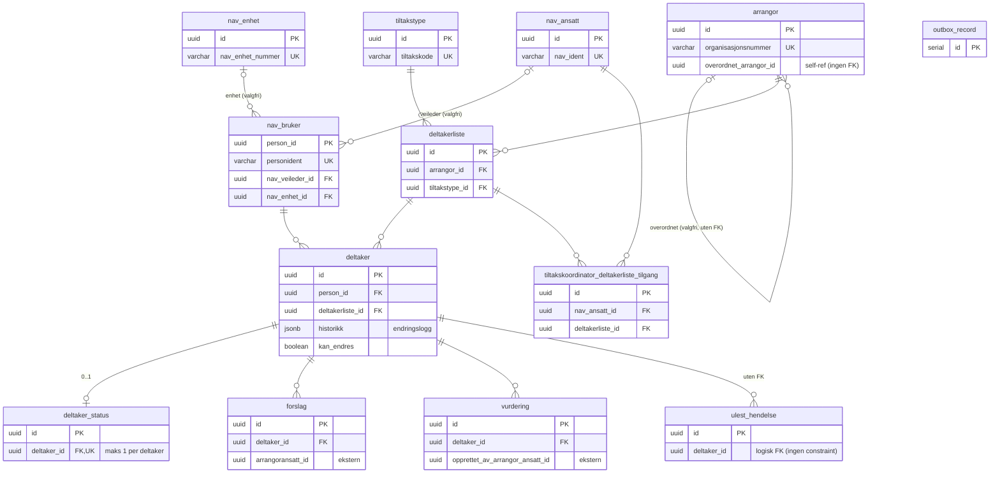

# amt-deltaker-bff — ER-diagram

## Oversikt

Diagrammet viser primærnøkler, fremmednøkler, unike nøkler og eksterne ID-er
for lesbarhet. Speiler skjemaet **etter V59-migreringen**. Se
[kolonnedetaljer](#kolonnedetaljer) for alle kolonner per tabell.

> **Forskjeller fra `amt-deltaker`:**
> - Ingen `vedtak`, `deltaker_endring`, `endring_fra_*`, `importert_fra_arena`
>   eller `innsok_paa_felles_oppstart` — endringshistorikk lagres som JSONB i
>   `deltaker.historikk`.
> - `deltaker_status` har **én** rad per deltaker (UNIQUE INDEX `(deltaker_id)`
>   INCLUDE `(type)`) — ikke historikk slik som i `amt-deltaker`.
> - To bff-spesifikke tabeller: `tiltakskoordinator_deltakerliste_tilgang` og
>   `ulest_hendelse`.
> - `outbox_record` for Kafka-publisering.

## Tabelloversikt

| Tabell | Beskrivelse | Størrelse (ca.) |
|---|---|---|
| `deltaker` | Hovedtabell for deltakere; `historikk` JSONB lagrer endringer | 1.67M rader / 2.2 GB |
| `deltaker_status` | Gjeldende status per deltaker (maks 1, UNIQUE) | 1.66M rader / 446 MB |
| `nav_bruker` | Persondata for brukere | 786k rader / 702 MB |
| `deltakerliste` | Tiltaksgjennomføringer | 177k rader / 48 MB |
| `ulest_hendelse` | Uleste hendelser for tiltakskoordinator | 14 737 rader |
| `arrangor` | Arrangører (underordnet/overordnet) | 20 767 rader |
| `nav_ansatt` | Nav-ansatte | 13 262 rader |
| `vurdering` | Arrangørs vurdering av deltaker | 4 181 rader |
| `tiltakskoordinator_deltakerliste_tilgang` | Tilgangsperioder for koordinatorer | 3 725 rader |
| `forslag` | Forslag fra arrangør-ansatte | 990 rader |
| `nav_enhet` | Nav-enheter | 446 rader |
| `tiltakstype` | Tiltakstype-definisjon | 17 rader |
| `outbox_record` | Kafka outbox for event-publisering (frittstående) | < 100 rader (renses) |

## Kolonnedetaljer

> **NB:** Reflekterer skjemaet **etter V59**.

### arrangor

| Kolonne | Type | Nullable | Constraint |
|---|---|---|---|
| `id` | uuid | NOT NULL | PK |
| `navn` | varchar | NOT NULL | |
| `organisasjonsnummer` | varchar | NOT NULL | UNIQUE |
| `overordnet_arrangor_id` | uuid | | logisk → arrangor(id) (ingen FK pga. Kafka-rekkefølge) |
| `created_at` | timestamptz | NOT NULL | default now() |
| `modified_at` | timestamptz | NOT NULL | default now() |

### tiltakstype

| Kolonne | Type | Nullable | Constraint |
|---|---|---|---|
| `id` | uuid | NOT NULL | PK |
| `navn` | varchar | NOT NULL | |
| `tiltakskode` | varchar | NOT NULL | UNIQUE |
| `innhold` | jsonb | | |
| `innsatsgrupper` | jsonb | NOT NULL | default `'[]'` |
| `created_at` | timestamptz | NOT NULL | default now() |
| `modified_at` | timestamptz | NOT NULL | default now() |

### nav_ansatt

| Kolonne | Type | Nullable | Constraint |
|---|---|---|---|
| `id` | uuid | NOT NULL | PK |
| `nav_ident` | varchar | NOT NULL | UNIQUE |
| `navn` | varchar | NOT NULL | |
| `epost` | varchar | | |
| `telefon` | varchar | | |
| `created_at` | timestamptz | NOT NULL | default now() |
| `modified_at` | timestamptz | NOT NULL | default now() |

### nav_enhet

| Kolonne | Type | Nullable | Constraint |
|---|---|---|---|
| `id` | uuid | NOT NULL | PK |
| `nav_enhet_nummer` | varchar | NOT NULL | UNIQUE |
| `navn` | varchar | NOT NULL | |
| `created_at` | timestamptz | NOT NULL | default now() |
| `modified_at` | timestamptz | NOT NULL | default now() |

### nav_bruker

| Kolonne | Type | Nullable | Constraint |
|---|---|---|---|
| `person_id` | uuid | NOT NULL | PK |
| `personident` | varchar | NOT NULL | UNIQUE *(lagt til i V59)* |
| `fornavn` | varchar | NOT NULL | |
| `mellomnavn` | varchar | | |
| `etternavn` | varchar | NOT NULL | |
| `adresse` | jsonb | | |
| `adressebeskyttelse` | varchar | | |
| `er_skjermet` | boolean | NOT NULL | |
| `nav_veileder_id` | uuid | | FK → nav_ansatt(id) |
| `nav_enhet_id` | uuid | | FK → nav_enhet(id) |
| `oppfolgingsperioder` | jsonb | | |
| `innsatsgruppe` | varchar | | |
| `created_at` | timestamptz | NOT NULL | default now() |
| `modified_at` | timestamptz | NOT NULL | default now() |

### deltakerliste

| Kolonne | Type | Nullable | Constraint |
|---|---|---|---|
| `id` | uuid | NOT NULL | PK |
| `navn` | varchar | NOT NULL | |
| `status` | varchar | | |
| `arrangor_id` | uuid | NOT NULL | FK → arrangor(id) |
| `tiltakstype_id` | uuid | NOT NULL | FK → tiltakstype(id) |
| `start_dato` | date | | |
| `slutt_dato` | date | | |
| `oppstart` | varchar | | |
| `apent_for_pamelding` | boolean | NOT NULL | |
| `oppmote_sted` | varchar | | |
| `pameldingstype` | varchar | | |
| `antall_plasser` | int | | |
| `created_at` | timestamptz | NOT NULL | default now() |
| `modified_at` | timestamptz | NOT NULL | default now() |

### deltaker

| Kolonne | Type | Nullable | Constraint |
|---|---|---|---|
| `id` | uuid | NOT NULL | PK |
| `person_id` | uuid | NOT NULL | FK → nav_bruker(person_id) |
| `deltakerliste_id` | uuid | NOT NULL | FK → deltakerliste(id) |
| `startdato` | date | | |
| `sluttdato` | date | | |
| `dager_per_uke` | double precision | | |
| `deltakelsesprosent` | double precision | | |
| `bakgrunnsinformasjon` | text | | |
| `innhold` | jsonb | | |
| `historikk` | jsonb | NOT NULL | default `'[]'` — endringslogg |
| `kan_endres` | boolean | NOT NULL | default true *(NOT NULL i V59)* |
| `sist_besokt` | timestamptz | | |
| `er_manuelt_delt_med_arrangor` | boolean | NOT NULL | default false |
| `created_at` | timestamptz | NOT NULL | default now() |
| `modified_at` | timestamptz | NOT NULL | default now() |

### deltaker_status

> Kun **én** rad per deltaker (UNIQUE INDEX `(deltaker_id) INCLUDE (type)`).
> Ikke historikk — kun gjeldende status. En deltaker kan mangle statusrad
> (ingen DB-constraint krever eksistens). Historisk endring lagres i
> `deltaker.historikk` (JSONB).

| Kolonne | Type | Nullable | Constraint |
|---|---|---|---|
| `id` | uuid | NOT NULL | PK |
| `deltaker_id` | uuid | NOT NULL | FK → deltaker(id), UNIQUE |
| `type` | varchar | NOT NULL | |
| `aarsak` | jsonb | | |
| `gyldig_fra` | timestamptz | NOT NULL | |
| `created_at` | timestamptz | NOT NULL | default now() |

### forslag

| Kolonne | Type | Nullable | Constraint |
|---|---|---|---|
| `id` | uuid | NOT NULL | PK |
| `deltaker_id` | uuid | NOT NULL | FK → deltaker(id) *(NOT NULL i V59)* |
| `arrangoransatt_id` | uuid | NOT NULL | ekstern ID (ingen FK) |
| `opprettet` | timestamptz | NOT NULL | |
| `begrunnelse` | varchar | | |
| `endring` | jsonb | NOT NULL | |
| `status` | jsonb | NOT NULL | |
| `created_at` | timestamptz | NOT NULL | default now() |
| `modified_at` | timestamptz | NOT NULL | default now() |

### vurdering

> `created_at`/`modified_at` fikk default + NOT NULL i V59 (var nullable uten default i V44).

| Kolonne | Type | Nullable | Constraint |
|---|---|---|---|
| `id` | uuid | NOT NULL | PK |
| `deltaker_id` | uuid | NOT NULL | FK → deltaker(id) |
| `opprettet_av_arrangor_ansatt_id` | uuid | NOT NULL | ekstern ID (ingen FK) |
| `vurderingstype` | varchar | NOT NULL | |
| `begrunnelse` | varchar | | |
| `opprettet` | timestamptz | NOT NULL | domene-tidspunkt fra arrangør |
| `created_at` | timestamptz | NOT NULL | default now() *(satt i V59)* |
| `modified_at` | timestamptz | NOT NULL | default now() *(satt i V59)* |

### tiltakskoordinator_deltakerliste_tilgang

| Kolonne | Type | Nullable | Constraint |
|---|---|---|---|
| `id` | uuid | NOT NULL | PK |
| `nav_ansatt_id` | uuid | NOT NULL | FK → nav_ansatt(id) |
| `deltakerliste_id` | uuid | NOT NULL | FK → deltakerliste(id) |
| `gyldig_fra` | timestamptz | NOT NULL | |
| `gyldig_til` | timestamptz | | CHECK `gyldig_til IS NULL OR gyldig_til >= gyldig_fra` *(V59)* |
| `created_at` | timestamptz | NOT NULL | default now() *(NOT NULL i V59)* |
| `modified_at` | timestamptz | NOT NULL | default now() *(NOT NULL i V59)* |

### ulest_hendelse

| Kolonne | Type | Nullable | Constraint |
|---|---|---|---|
| `id` | uuid | NOT NULL | PK |
| `deltaker_id` | uuid | NOT NULL | logisk → deltaker(id) (ingen FK pga. Kafka-rekkefølge) |
| `opprettet` | timestamptz | NOT NULL | |
| `ansvarlig` | jsonb | | |
| `hendelse` | jsonb | NOT NULL | |
| `created_at` | timestamptz | NOT NULL | default now() |
| `modified_at` | timestamptz | NOT NULL | default now() |

### outbox_record

| Kolonne | Type | Nullable | Constraint |
|---|---|---|---|
| `id` | serial | NOT NULL | PK |
| `key` | varchar(255) | NOT NULL | |
| `value` | jsonb | NOT NULL | |
| `value_type` | varchar(255) | NOT NULL | |
| `topic` | varchar(255) | NOT NULL | |
| `created_at` | timestamptz | NOT NULL | default now() |
| `modified_at` | timestamptz | NOT NULL | default now() |
| `processed_at` | timestamptz | | |
| `status` | varchar(50) | NOT NULL | default 'PENDING' |
| `retry_count` | int | NOT NULL | default 0 |
| `retried_at` | timestamptz | | |
| `error_message` | text | | |

## Merknader

- **Eksterne ID-er uten FK:** `arrangoransatt_id` (forslag) og
  `opprettet_av_arrangor_ansatt_id` (vurdering) peker på
  `amt-arrangor`-databasen — bevisst uten FK.
- **Logiske FK-er uten constraint** (Kafka-rekkefølge-risiko):
  `arrangor.overordnet_arrangor_id` og `ulest_hendelse.deltaker_id`. En
  barn-rad kan ankomme før parent fra ulike Kafka-topics, derfor håndheves
  ikke integriteten i databasen.
- **Endringslogg:** `deltaker.historikk` (JSONB) lagrer endringer som ellers
  ville hatt egne tabeller (`vedtak`, `deltaker_endring`, …) i `amt-deltaker`.
- **Aktiv status:** `deltaker_status` har maks én rad per deltaker (UNIQUE
  INDEX) — ingen `gyldig_til`-håndtering på radnivå. En deltaker kan mangle
  statusrad i databasen (ingen constraint krever eksistens). Tidligere
  statuser finnes i `deltaker.historikk`.
- **`outbox_record`** er en frittstående tabell uten relasjoner.

