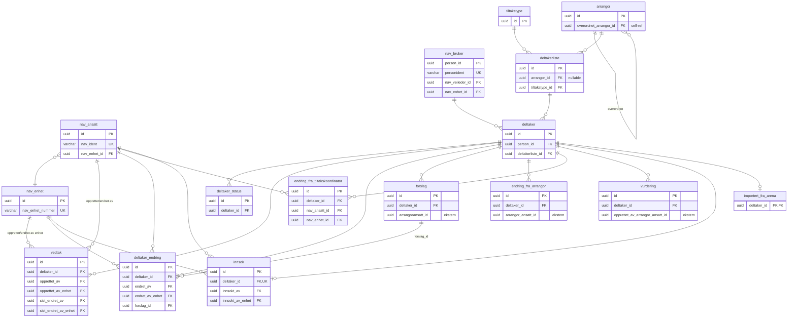

# amt-deltaker — ER-diagram

## Oversikt

Diagrammet viser primærnøkler, fremmednøkler, unike nøkler og eksterne ID-er for lesbarhet.
Se [kolonnedetaljer](#kolonnedetaljer) for alle kolonner per tabell.

## Tabelloversikt

| Tabell | Beskrivelse | Størrelse (ca.) |
|---|---|---|
| `deltaker` | Hovedtabell for deltakere | 1.66M rader |
| `deltaker_status` | Statushistorikk per deltaker (gyldig_til IS NULL = aktiv) | 2.3M rader |
| `nav_bruker` | Persondata for brukere | 786k rader |
| `deltakerliste` | Tiltaksgjennomføringer (grupper eller enkeltplass) | ~30k rader |
| `vedtak` | Nav-vedtak knyttet til deltaker | 143k rader |
| `deltaker_endring` | Endringslogg fra Nav-veiledere | 195k rader |
| `forslag` | Forslag fra arrangør-ansatte | — |
| `endring_fra_arrangor` | Endringer initiert av arrangør | — |
| `endring_fra_tiltakskoordinator` | Endringer fra tiltakskoordinator | — |
| `vurdering` | Arrangørs vurdering av deltaker | — |
| `innsok` | Innsøking til felles oppstart | 18k rader |
| `importert_fra_arena` | Arena-importerte deltaker-snapshots | 1.5M rader (765 MB) |
| `tiltakstype` | Tiltakstype-definisjon | Liten |
| `arrangor` | Arrangører (underordnet/overordnet) | Liten |
| `nav_ansatt` | Nav-ansatte | Liten |
| `nav_enhet` | Nav-enheter | Liten |
| `outbox_record` | Kafka outbox for event-publisering (frittstående) | — |

## Kolonnedetaljer

### arrangor

| Kolonne | Type | Nullable | Constraint |
|---|---|---|---|
| `id` | uuid | NOT NULL | PK |
| `navn` | varchar | NOT NULL | |
| `organisasjonsnummer` | varchar | NOT NULL | UNIQUE |
| `overordnet_arrangor_id` | uuid | | FK → arrangor(id) |
| `created_at` | timestamptz | NOT NULL | default now() |
| `modified_at` | timestamptz | NOT NULL | default now() |

### tiltakstype

| Kolonne | Type | Nullable | Constraint |
|---|---|---|---|
| `id` | uuid | NOT NULL | PK |
| `navn` | varchar | NOT NULL | |
| `innhold` | jsonb | | |
| `tiltakskode` | varchar | NOT NULL | UNIQUE |
| `innsatsgrupper` | jsonb | NOT NULL | |
| `created_at` | timestamptz | NOT NULL | default now() |
| `modified_at` | timestamptz | NOT NULL | default now() |

### nav_ansatt

| Kolonne | Type | Nullable | Constraint |
|---|---|---|---|
| `id` | uuid | NOT NULL | PK |
| `nav_ident` | varchar | NOT NULL | UNIQUE |
| `navn` | varchar | NOT NULL | |
| `telefonnummer` | varchar | | |
| `epost` | varchar | | |
| `nav_enhet_id` | uuid | | FK → nav_enhet(id) |
| `created_at` | timestamptz | NOT NULL | default now() |
| `modified_at` | timestamptz | NOT NULL | default now() |

### nav_enhet

| Kolonne | Type | Nullable | Constraint |
|---|---|---|---|
| `id` | uuid | NOT NULL | PK |
| `nav_enhet_nummer` | varchar | NOT NULL | UNIQUE |
| `navn` | varchar | NOT NULL | |
| `created_at` | timestamptz | NOT NULL | default now() |
| `modified_at` | timestamptz | NOT NULL | default now() |

### nav_bruker

| Kolonne | Type | Nullable | Constraint |
|---|---|---|---|
| `person_id` | uuid | NOT NULL | PK |
| `personident` | varchar | NOT NULL | UNIQUE |
| `fornavn` | varchar | NOT NULL | |
| `mellomnavn` | varchar | | |
| `etternavn` | varchar | NOT NULL | |
| `telefonnummer` | varchar | | |
| `epost` | varchar | | |
| `adresse` | jsonb | | |
| `adressebeskyttelse` | varchar | | |
| `er_skjermet` | boolean | NOT NULL | default false |
| `nav_veileder_id` | uuid | | FK → nav_ansatt(id) |
| `nav_enhet_id` | uuid | | FK → nav_enhet(id) |
| `oppfolgingsperioder` | jsonb | | |
| `innsatsgruppe` | varchar | | |
| `created_at` | timestamptz | NOT NULL | default now() |
| `modified_at` | timestamptz | NOT NULL | default now() |

### deltakerliste

| Kolonne | Type | Nullable | Constraint |
|---|---|---|---|
| `id` | uuid | NOT NULL | PK |
| `navn` | varchar | NOT NULL | |
| `status` | varchar | | |
| `arrangor_id` | uuid | | FK → arrangor(id) |
| `tiltakstype_id` | uuid | NOT NULL | FK → tiltakstype(id) |
| `start_dato` | date | | |
| `slutt_dato` | date | | |
| `oppstart` | varchar | | |
| `apent_for_pamelding` | boolean | NOT NULL | default true |
| `oppmote_sted` | varchar | | |
| `gjennomforingstype` | varchar | NOT NULL | |
| `pameldingstype` | varchar | | |
| `prisinformasjon` | varchar | | |
| `antall_plasser` | int | | |
| `modified_at` | timestamptz | NOT NULL | default now() |
| `created_at` | timestamptz | NOT NULL | default now() |

### deltaker

| Kolonne | Type | Nullable | Constraint |
|---|---|---|---|
| `id` | uuid | NOT NULL | PK |
| `person_id` | uuid | NOT NULL | FK → nav_bruker(person_id) |
| `deltakerliste_id` | uuid | NOT NULL | FK → deltakerliste(id) |
| `startdato` | date | | |
| `sluttdato` | date | | |
| `dager_per_uke` | double precision | | |
| `deltakelsesprosent` | double precision | | |
| `bakgrunnsinformasjon` | text | | |
| `innhold` | jsonb | | |
| `kilde` | varchar | NOT NULL | |
| `er_manuelt_delt_med_arrangor` | boolean | NOT NULL | default false |
| `created_at` | timestamptz | NOT NULL | default now() |
| `modified_at` | timestamptz | NOT NULL | default now() |

### deltaker_status

| Kolonne | Type | Nullable | Constraint |
|---|---|---|---|
| `id` | uuid | NOT NULL | PK |
| `deltaker_id` | uuid | NOT NULL | FK → deltaker(id) |
| `type` | varchar | NOT NULL | |
| `aarsak` | varchar | | |
| `gyldig_fra` | timestamptz | NOT NULL | |
| `gyldig_til` | timestamptz | | |
| `created_at` | timestamptz | NOT NULL | default now() |
| `modified_at` | timestamptz | NOT NULL | default now() |

### vedtak

| Kolonne | Type | Nullable | Constraint |
|---|---|---|---|
| `id` | uuid | NOT NULL | PK |
| `deltaker_id` | uuid | NOT NULL | FK → deltaker(id), UNIQUE |
| `fattet` | timestamptz | | |
| `gyldig_til` | timestamptz | | |
| `deltaker_ved_vedtak` | jsonb | NOT NULL | |
| `fattet_av_nav` | boolean | NOT NULL | |
| `opprettet_av` | uuid | NOT NULL | FK → nav_ansatt(id) |
| `opprettet_av_enhet` | uuid | NOT NULL | FK → nav_enhet(id) |
| `sist_endret_av` | uuid | NOT NULL | FK → nav_ansatt(id) |
| `sist_endret_av_enhet` | uuid | NOT NULL | FK → nav_enhet(id) |
| `created_at` | timestamptz | NOT NULL | default now() |
| `modified_at` | timestamptz | NOT NULL | default now() |

### deltaker_endring

| Kolonne | Type | Nullable | Constraint |
|---|---|---|---|
| `id` | uuid | NOT NULL | PK |
| `deltaker_id` | uuid | NOT NULL | FK → deltaker(id) |
| `endring` | jsonb | NOT NULL | |
| `endret_av` | uuid | NOT NULL | FK → nav_ansatt(id) |
| `endret_av_enhet` | uuid | NOT NULL | FK → nav_enhet(id) |
| `forslag_id` | uuid | | FK → forslag(id) |
| `behandlet` | timestamptz | | |
| `endret` | timestamptz | | |
| `created_at` | timestamptz | NOT NULL | default now() |
| `modified_at` | timestamptz | NOT NULL | default now() |

### forslag

| Kolonne | Type | Nullable | Constraint |
|---|---|---|---|
| `id` | uuid | NOT NULL | PK |
| `deltaker_id` | uuid | NOT NULL | FK → deltaker(id) |
| `arrangoransatt_id` | uuid | NOT NULL | ekstern ID (ingen FK) |
| `opprettet` | timestamptz | NOT NULL | |
| `begrunnelse` | varchar | | |
| `endring` | jsonb | NOT NULL | |
| `status` | jsonb | NOT NULL | |
| `created_at` | timestamptz | NOT NULL | default now() |
| `modified_at` | timestamptz | NOT NULL | default now() |

### endring_fra_arrangor

| Kolonne | Type | Nullable | Constraint |
|---|---|---|---|
| `id` | uuid | NOT NULL | PK |
| `deltaker_id` | uuid | NOT NULL | FK → deltaker(id) |
| `arrangor_ansatt_id` | uuid | NOT NULL | ekstern ID (ingen FK) |
| `opprettet` | timestamptz | NOT NULL | |
| `endring` | jsonb | NOT NULL | |
| `created_at` | timestamptz | NOT NULL | default now() |
| `modified_at` | timestamptz | NOT NULL | default now() |

### endring_fra_tiltakskoordinator

| Kolonne | Type | Nullable | Constraint |
|---|---|---|---|
| `id` | uuid | NOT NULL | PK |
| `deltaker_id` | uuid | NOT NULL | FK → deltaker(id) |
| `nav_ansatt_id` | uuid | NOT NULL | FK → nav_ansatt(id) |
| `nav_enhet_id` | uuid | NOT NULL | FK → nav_enhet(id) |
| `endret` | timestamptz | NOT NULL | |
| `endring` | jsonb | NOT NULL | |
| `created_at` | timestamptz | NOT NULL | default now() |
| `modified_at` | timestamptz | NOT NULL | default now() |

### vurdering

| Kolonne | Type | Nullable | Constraint |
|---|---|---|---|
| `id` | uuid | NOT NULL | PK |
| `deltaker_id` | uuid | NOT NULL | FK → deltaker(id) |
| `opprettet_av_arrangor_ansatt_id` | uuid | NOT NULL | ekstern ID (ingen FK) |
| `vurderingstype` | varchar | NOT NULL | |
| `begrunnelse` | varchar | | |
| `gyldig_fra` | timestamptz | NOT NULL | |
| `created_at` | timestamptz | NOT NULL | default now() |

### innsok

| Kolonne | Type | Nullable | Constraint |
|---|---|---|---|
| `id` | uuid | NOT NULL | PK |
| `deltaker_id` | uuid | NOT NULL | FK → deltaker(id), UNIQUE |
| `innsokt` | timestamptz | | |
| `innsokt_av` | uuid | NOT NULL | FK → nav_ansatt(id) |
| `innsokt_av_enhet` | uuid | NOT NULL | FK → nav_enhet(id) |
| `deltakelsesinnhold_ved_innsok` | jsonb | | |
| `utkast_delt` | timestamptz | | |
| `utkast_godkjent_av_nav` | boolean | NOT NULL | |
| `created_at` | timestamptz | NOT NULL | default now() |
| `modified_at` | timestamptz | NOT NULL | default now() |

### importert_fra_arena

| Kolonne | Type | Nullable | Constraint |
|---|---|---|---|
| `deltaker_id` | uuid | NOT NULL | PK, FK → deltaker(id) |
| `deltaker_ved_import` | jsonb | NOT NULL | |
| `importert_dato` | timestamptz | NOT NULL | |

### outbox_record

| Kolonne | Type | Nullable | Constraint |
|---|---|---|---|
| `id` | serial | NOT NULL | PK |
| `key` | varchar(255) | NOT NULL | |
| `value` | jsonb | NOT NULL | |
| `value_type` | varchar(255) | NOT NULL | |
| `topic` | varchar(255) | NOT NULL | |
| `created_at` | timestamptz | NOT NULL | default now() |
| `modified_at` | timestamptz | NOT NULL | default now() |
| `processed_at` | timestamptz | | |
| `status` | varchar(50) | NOT NULL | default 'PENDING' |
| `retry_count` | int | NOT NULL | default 0 |
| `retried_at` | timestamptz | | |
| `error_message` | text | | |

## Merknader

- **Ekstern-ID-er uten FK:** `arrangor_ansatt_id` (endring_fra_arrangor, forslag) og `opprettet_av_arrangor_ansatt_id` (vurdering) peker på `amt-arrangor`-databasen — bevisst uten FK constraint.
- **Aktiv status:** Mønsteret `gyldig_til IS NULL AND gyldig_fra <= CURRENT_TIMESTAMP` brukes for å finne aktiv deltaker-status.
- **Planlagte statusendringer:** En deltaker kan ha maks 2 aktive rader i `deltaker_status`: én nåværende + én fremtidig slutt-status.
- **outbox_record** er en frittstående tabell uten relasjoner til resten av skjemaet.
