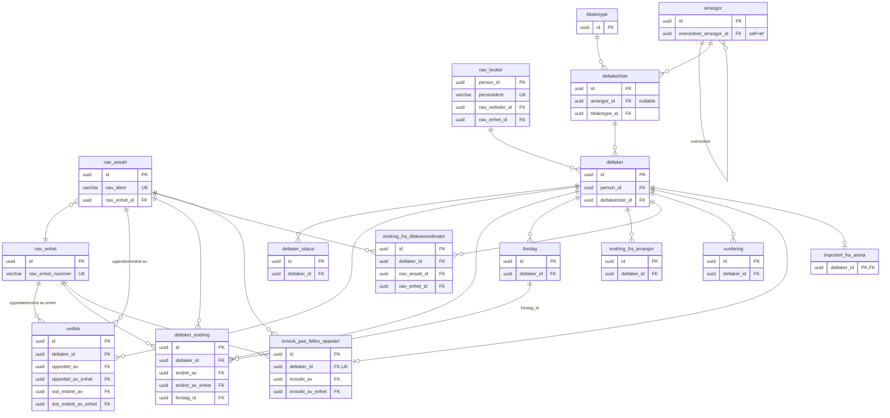

# amt-deltaker — ER-diagram

## Oversikt

Diagrammet viser kun primærnøkler, fremmednøkler og unike nøkler for lesbarhet.
Se [tabelloversikten](#tabelloversikt) for alle kolonner.

## Tabelloversikt

| Tabell | Beskrivelse | Størrelse (ca.) |
|---|---|---|
| `deltaker` | Hovedtabell for deltakere | 1.66M rader |
| `deltaker_status` | Statushistorikk per deltaker (gyldig_til IS NULL = aktiv) | 2.3M rader |
| `nav_bruker` | Persondata for brukere | 786k rader |
| `deltakerliste` | Tiltaksgjennomføringer (grupper eller enkeltplass) | ~30k rader |
| `vedtak` | Nav-vedtak knyttet til deltaker | 143k rader |
| `deltaker_endring` | Endringslogg fra Nav-veiledere | 195k rader |
| `forslag` | Forslag fra arrangør-ansatte | — |
| `endring_fra_arrangor` | Endringer initiert av arrangør | — |
| `endring_fra_tiltakskoordinator` | Endringer fra tiltakskoordinator | — |
| `vurdering` | Arrangørs vurdering av deltaker | — |
| `innsok_paa_felles_oppstart` | Innsøking til felles oppstart | 18k rader |
| `importert_fra_arena` | Arena-importerte deltaker-snapshots | 1.5M rader (765 MB) |
| `tiltakstype` | Tiltakstype-definisjon | Liten |
| `arrangor` | Arrangører (underordnet/overordnet) | Liten |
| `nav_ansatt` | Nav-ansatte | Liten |
| `nav_enhet` | Nav-enheter | Liten |
| `outbox_record` | Kafka outbox for event-publisering (frittstående) | — |

## Merknader

- **Ekstern-ID-er uten FK:** `arrangor_ansatt_id` (endring_fra_arrangor, forslag) og `opprettet_av_arrangor_ansatt_id` (vurdering) peker på `amt-arrangor`-databasen — bevisst uten FK constraint.
- **Aktiv status:** Mønsteret `gyldig_til IS NULL AND gyldig_fra <= CURRENT_TIMESTAMP` brukes for å finne aktiv deltaker-status.
- **Planlagte statusendringer:** En deltaker kan ha maks 2 aktive rader i `deltaker_status`: én nåværende + én fremtidig slutt-status.
- **outbox_record** er en frittstående tabell uten relasjoner til resten av skjemaet.
