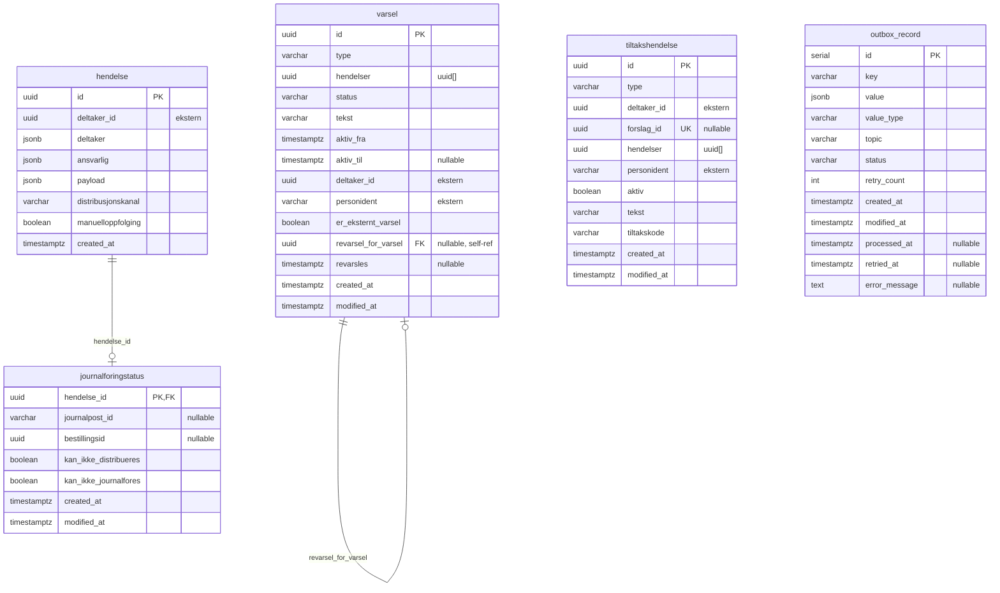

# amt-distribusjon — ER-diagram

## Oversikt

Diagrammet viser tabellene i `amt-distribusjon`, som h&aring;ndterer journalf&oslash;ring,
distribusjon og varsling av hendelser knyttet til deltakere.

Tabellene `hendelse`, `journalforingstatus`, `tiltakshendelse` og `varsel` er
domene-tabeller. `outbox_record` er en fristilt Kafka outbox-tabell.
`deltaker_id` og `personident` er eksterne referanser til `amt-deltaker` (ingen FK).

## Tabelloversikt

| Tabell | Beskrivelse | St&oslash;rrelse (ca.) |
|---|---|---|
| `hendelse` | Append-only event-logg for deltaker-hendelser fra Kafka | 1.14M rader (1.7 GB) |
| `journalforingstatus` | 1:1-status for journalf&oslash;ring/distribusjon per hendelse | 460k rader (86 MB) |
| `varsel` | Beskjeder og varsler sendt til bruker via min side | 514k rader (214 MB) |
| `tiltakshendelse` | Aggregerte tiltakshendelser per deltaker/forslag | 257k rader (100 MB) |
| `outbox_record` | Kafka outbox (t&oslash;mmes etter publisering) | ~0 rader |

## Kolonnedetaljer

### hendelse

| Kolonne | Type | Nullable | Constraint |
|---|---|---|---|
| `id` | uuid | NOT NULL | PK |
| `deltaker_id` | uuid | NOT NULL | ekstern (ingen FK) |
| `deltaker` | jsonb | NOT NULL | |
| `ansvarlig` | jsonb | NOT NULL | |
| `payload` | jsonb | NOT NULL | |
| `distribusjonskanal` | varchar | NOT NULL | |
| `manuelloppfolging` | boolean | NOT NULL | |
| `created_at` | timestamptz | NOT NULL | default now() |

> Append-only: `INSERT ... ON CONFLICT (id) DO NOTHING`. Ingen `modified_at` (bevisst).

### journalforingstatus

| Kolonne | Type | Nullable | Constraint |
|---|---|---|---|
| `hendelse_id` | uuid | NOT NULL | PK, FK &rarr; hendelse(id) |
| `journalpost_id` | varchar | | |
| `bestillingsid` | uuid | | |
| `kan_ikke_distribueres` | boolean | NOT NULL | default false |
| `kan_ikke_journalfores` | boolean | NOT NULL | default false |
| `created_at` | timestamptz | NOT NULL | default now() |
| `modified_at` | timestamptz | NOT NULL | default now() |

> `journalpost_id` og `bestillingsid` er N:1 (flere hendelser kan dele
> samme journalpost/bestilling ved endringsvedtak).

### varsel

| Kolonne | Type | Nullable | Constraint |
|---|---|---|---|
| `id` | uuid | NOT NULL | PK |
| `type` | varchar | NOT NULL | |
| `hendelser` | uuid[] | NOT NULL | default '{}' |
| `status` | varchar | NOT NULL | |
| `tekst` | varchar | NOT NULL | |
| `aktiv_fra` | timestamptz | NOT NULL | |
| `aktiv_til` | timestamptz | | |
| `deltaker_id` | uuid | NOT NULL | ekstern (ingen FK) |
| `personident` | varchar | NOT NULL | ekstern (ingen FK) |
| `er_eksternt_varsel` | boolean | NOT NULL | default false |
| `revarsel_for_varsel` | uuid | | FK &rarr; varsel(id), self-ref |
| `revarsles` | timestamptz | | |
| `created_at` | timestamptz | NOT NULL | default now() |
| `modified_at` | timestamptz | NOT NULL | default now() |

### tiltakshendelse

| Kolonne | Type | Nullable | Constraint |
|---|---|---|---|
| `id` | uuid | NOT NULL | PK |
| `type` | varchar | NOT NULL | |
| `deltaker_id` | uuid | NOT NULL | ekstern (ingen FK) |
| `forslag_id` | uuid | | UNIQUE |
| `hendelser` | uuid[] | NOT NULL | default '{}' |
| `personident` | varchar | NOT NULL | ekstern (ingen FK) |
| `aktiv` | boolean | NOT NULL | |
| `tekst` | varchar | NOT NULL | |
| `tiltakskode` | varchar | NOT NULL | |
| `created_at` | timestamptz | NOT NULL | default now() |
| `modified_at` | timestamptz | NOT NULL | default now() |

### outbox_record

| Kolonne | Type | Nullable | Constraint |
|---|---|---|---|
| `id` | serial | NOT NULL | PK |
| `key` | varchar(255) | NOT NULL | |
| `value` | jsonb | NOT NULL | |
| `value_type` | varchar(255) | NOT NULL | |
| `topic` | varchar(255) | NOT NULL | |
| `created_at` | timestamptz | NOT NULL | default now() |
| `modified_at` | timestamptz | NOT NULL | default now() |
| `processed_at` | timestamptz | | |
| `status` | varchar(50) | NOT NULL | default 'PENDING' |
| `retry_count` | int | NOT NULL | default 0 |
| `retried_at` | timestamptz | | |
| `error_message` | text | | |

## Indekser

| Tabell | Indeks | Definisjon |
|---|---|---|
| `hendelse` | `hendelse_id_created_at_dist_idx` | `(id, created_at) WHERE distribusjonskanal NOT IN ('DITT_NAV','SDP')` |
| `journalforingstatus` | `journalforingstatus_journalfores_idx` | Partial: rader klare for journalf&oslash;ring |
| `journalforingstatus` | `journalforingstatus_distribueres_idx3` | Partial: rader klare for distribusjon |
| `tiltakshendelse` | `tiltakshendelse_deltaker_id_idx` | `(deltaker_id)` |
| `tiltakshendelse` | `tiltakshendelse_forslag_unique_id_idx` | `UNIQUE (forslag_id)` |
| `tiltakshendelse` | `tiltakshendelse_hendelser_gin_idx` | `GIN (hendelser)` |
| `varsel` | `varsel_deltaker_id_status_idx` | `(deltaker_id, status)` |
| `varsel` | `varsel_hendelser_gin_idx` | `GIN (hendelser)` |
| `varsel` | `varsel_revarsles_idx` | `(revarsles)` |

## Merknader

- **Ekstern-IDer uten FK:** `deltaker_id` og `personident` i `hendelse`, `varsel` og `tiltakshendelse` peker p&aring; data i `amt-deltaker` / `amt-deltaker-bff` — bevisst uten FK (separate databaser, Kafka-m&oslash;nster).
- **Append-only:** `hendelse` har kun `created_at`, ingen `modified_at` — rader oppdateres aldri.
- **N:1-relasjon:** `journalforingstatus.journalpost_id` og `bestillingsid` er *ikke* unike — endringsvedtak-m&oslash;nsteret slår sammen flere hendelser til &eacute;n journalpost/bestilling.
- **outbox_record** er en fristilt tabell uten relasjoner til resten av skjemaet.
- **V31-endringer (etter review):** `kan_ikke_distribueres`/`kan_ikke_journalfores` ble NOT NULL DEFAULT FALSE, `er_eksternt_varsel` ble NOT NULL, FK lagt p&aring; `journalforingstatus.hendelse_id` og self-FK p&aring; `varsel.revarsel_for_varsel`.

